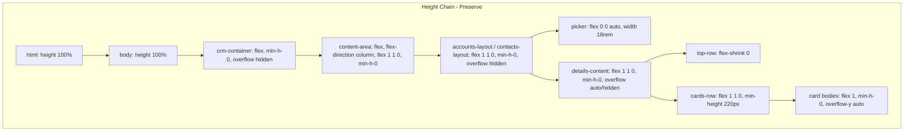

# Proposals Skin + Constellation Skeleton Merge — Master Execution Plan

A 3-pass plan to merge the **Constellation V.2 skeleton** (from [ACCOUNTS_PAGE_REFACTOR_GUIDE.md](ACCOUNTS_PAGE_REFACTOR_GUIDE.md)) with the **Proposals page aesthetic** (sharp corners, high-density typography, Dark Slate + Gold palette) across the TenWorks portal, without breaking flexbox layout chains.

---

## Pass 1: Macro Mapping — Similarities and Differences

### Structural Similarities (Skeleton — Preserve)

Both pages share:

- `crm-container` → `nav-sidebar` + `main.content-area`
- Flex-based layout with `min-h-0` and `overflow: hidden` for viewport fill
- Card-based content organization
- Transparent/glass-style panels

### Structural Differences (Skeleton — Contacts Follows Guide, Proposals Does Not)

| Aspect | Proposals | Contacts (Constellation V.2) |
|--------|-----------|------------------------------|
| **Layout pattern** | `grid grid-cols-[260px_1fr]` + Tailwind | `contacts-layout` flex, picker + details |
| **Content-area padding** | `p-4` (16px) | `1.25rem` (20px) from `.content-area` |
| **Details panel** | N/A (no picker/details split) | Transparent `.details-panel`, cards draw boxes |
| **Card structure** | Inline Tailwind (`bg-white/5`, `border-white/10`) | `.section-card` with `var(--glass-*)` |

**Conclusion:** The DOM/skeleton of Contacts and Accounts MUST remain as defined in the Refactor Guide. Only the **skin** (CSS variables and component styles) will be updated to match Proposals.

### Aesthetic Violations (Contacts vs Proposals — What Must Change)

| Violation | Contacts (Current) | Proposals (Target) |
|-----------|--------------------|--------------------|
| **Border radius** | `--glass-radius: 1rem` (16px) — soft corners | `0.75rem` (12px) — sharper |
| **Card padding** | `1.25rem 1rem 1rem`, section headers `1.25rem` inline | `p-4` (16px), section headers `mb-2`/`mb-3` |
| **Section title size** | `1.5rem` (24px) | `text-sm` (14px) font-semibold, or `text-xl` (20px) for page title |
| **Typography density** | Larger labels, looser line-height | `text-xs` (12px) labels, `text-sm` (14px) body |
| **Card backgrounds** | `rgba(0,0,0,0.12)` / `0.15` | `rgba(0,0,0,0.25)` / `0.3` (darker slate) |
| **Borders** | `var(--glass-border)` = `rgba(69,74,82,0.5)` | `rgba(255,255,255,0.1)` / `0.15` / `0.2` (lighter, more visible) |
| **Gaps** | `1.25rem` (20px) between cards | `gap-4` (16px) |
| **Form/input padding** | `0.5rem 0.75rem`, `py-2 px-3` equivalent | `py-2 px-3` (8px 12px) — tighter |

### High-Level Summary for Global CSS

1. **Reduce `--glass-radius`** from `1rem` to `0.75rem` (or introduce `--card-radius`).
2. **Introduce Proposals-style variables** for card backgrounds and borders (Dark Slate family).
3. **Tighten padding scale** for section headers, card bodies, and form elements.
4. **Reduce font sizes** for section titles and labels to achieve high-density typography.
5. **Reduce gaps** between cards and within cards from `1.25rem` to `1rem` (or `0.75rem` for tighter).

---

## Pass 2: Micro Mapping — Variables and Component Updates

### CSS Variable Adjustments (in `:root` and `body.theme-dark`)

| Variable | Current | Proposed |
|----------|---------|----------|
| `--glass-radius` | `1rem` | `0.75rem` |
| `--radius-lg` | `1rem` | `0.75rem` |
| `--radius-md` | `8px` | `6px` (optional) |
| **New:** `--card-bg` | — | `rgba(0,0,0,0.25)` |
| **New:** `--card-bg-form` | — | `rgba(0,0,0,0.3)` |
| **New:** `--card-border` | — | `rgba(255,255,255,0.1)` |
| **New:** `--card-border-strong` | — | `rgba(255,255,255,0.2)` |
| **New:** `--section-title-size` | — | `0.875rem` (14px) |
| **New:** `--section-header-padding` | — | `0.75rem 1rem` |
| **New:** `--card-gap` | — | `1rem` |

### Class Updates (Scoped to Cards, Pickers, Section Headers)

**Do NOT touch:** Layout properties (`display`, `flex`, `flex-direction`, `flex: 1 1 0`, `min-height: 0`, `overflow`).

**Update only aesthetic properties:**

1. **Section cards (Accounts + Contacts)**
   - Replace `rgba(0,0,0,0.12)` with `var(--card-bg)` or `rgba(0,0,0,0.25)`
   - Replace `rgba(0,0,0,0.15)` (form card) with `var(--card-bg-form)` or `rgba(0,0,0,0.3)`
   - Replace `var(--glass-border)` with `var(--card-border)` or `1px solid rgba(255,255,255,0.1)`
   - Replace `var(--glass-radius)` with `var(--glass-radius)` (already updated to 0.75rem)

2. **Section card headers** (`.account-*-card .section-card-header`, `.contact-*-card .section-card-header`)
   - `padding-inline: 1.25rem; padding-top: 1.25rem; padding-bottom: 0.5rem` → `padding: 0.75rem 1rem; padding-bottom: 0.375rem`
   - `.section-title` font-size: `1.5rem` → `0.875rem` (or `1rem` for primary headers) with `font-weight: 600; text-transform: uppercase; letter-spacing: 0.05em`

3. **Picker panels** (`.account-picker-panel`, `.contact-picker-panel`)
   - Same background/border/radius as section cards
   - Header padding: reduce to match section headers

4. **Form cards** (`.account-details-form-card`, `.contact-details-form-card`)
   - Padding: `1.25rem 1rem 1rem` → `1rem 0.75rem 0.75rem`
   - Form grid gap: `0.75rem 1rem` → `0.5rem 0.75rem`

5. **Layout gaps**
   - `.accounts-layout`, `.contacts-layout` gap: `1.25rem` → `1rem`
   - `.account-cards-row`, `.contact-cards-row` gap: `1.25rem` → `1rem`; `margin-top: 1.25rem` → `1rem`
   - `.account-details-top-row`, `.contact-details-top-row` gap: `1.25rem` → `1rem`

6. **Form buttons row**
   - `margin-top: 1.25rem; margin-bottom: 0.5rem` → `margin-top: 1rem; margin-bottom: 0.375rem`
   - `gap: 0.625rem` → `gap: 0.5rem`

7. **Activity items, list items**
   - `padding: 0.75rem 0` → `padding: 0.5rem 0`
   - Font sizes: `.activity-meta`, `.activity-date` already `0.75rem` — keep or reduce to `0.7rem` for extra density

---

## Pass 3: Integration and Stability Check

### Flexbox Layout Chain — DO NOT MODIFY

The following properties are **sacred** and must remain unchanged:

### Verification Checklist

- [ ] No changes to `display`, `flex`, `flex-direction`, `flex: 1 1 0`, `flex: 0 0 auto`
- [ ] No changes to `min-height: 0`, `overflow: hidden` on layout containers
- [ ] No changes to `overflow-y: auto` on card bodies (keep scrolling behavior)
- [ ] Transparent `.details-panel` overrides remain (no background, border, box-shadow)
- [ ] Card `min-height` values (e.g. 200px, 220px) unchanged for ratio locking
- [ ] Grid `grid-template-columns` unchanged (e.g. `minmax(0, 1fr) minmax(260px, 320px)`)

### Risk Mitigation

1. **Variable scope:** Introduce new variables (`--card-bg`, `--card-border`) rather than overwriting `--glass-border` globally, to avoid breaking modals or other glass UI that may depend on it. Alternatively, update `--glass-border` and `--glass-radius` if the intent is a full portal-wide skin change.
2. **Theme compatibility:** Apply variable overrides only within `:root` and `body.theme-dark`. Ensure `body.theme-light` and `body.theme-green` receive analogous adjustments if they use the same card classes.
3. **Proposals page:** The Proposals page uses Tailwind and inline styles. It will automatically benefit from updated `:root` variables (e.g. `--primary-blue`, `--glass-radius`) where it references them. No DOM changes needed for Proposals.

---

## Final Step-by-Step Execution Plan

### Phase 1: Global Variable Updates (style.css)

1. In `:root`, update:
   - `--glass-radius: 1rem` → `0.75rem`
   - `--radius-lg: 1rem` → `0.75rem`
2. Add new variables:
   - `--card-bg: rgba(0,0,0,0.25)`
   - `--card-bg-form: rgba(0,0,0,0.3)`
   - `--card-border: rgba(255,255,255,0.1)`
   - `--card-border-strong: rgba(255,255,255,0.2)`
   - `--section-header-padding: 0.75rem 1rem`
   - `--card-gap: 1rem`
3. Mirror in `body.theme-dark` if any overrides exist.

### Phase 2: Card and Picker Aesthetic Updates

4. Replace card backgrounds: `rgba(0,0,0,0.12)` → `var(--card-bg)`, `rgba(0,0,0,0.15)` → `var(--card-bg-form)` for:
   - `.account-picker-panel`, `.account-details-form-card`, `.account-deals-card`, `.account-contacts-card`, `.account-activities-card`
   - `.contact-picker-panel`, `.contact-details-form-card`, `.sequence-status-card`, `.ai-assistant-card`, `.contact-activities-card`, `.logged-emails-card`
5. Replace card borders: `var(--glass-border)` → `var(--card-border)` for the same selectors.
6. Ensure `border-radius: var(--glass-radius)` is used (will now resolve to 0.75rem).

### Phase 3: Padding and Typography Tightening

7. Update section card headers:
   - `padding-inline: 1.25rem; padding-top: 1.25rem; padding-bottom: 0.5rem` → `padding: var(--section-header-padding); padding-bottom: 0.375rem`
   - `.section-title` font-size: `1.5rem` → `0.875rem` (or `1rem` for main picker title), add `font-weight: 600; letter-spacing: 0.03em`
8. Update form card padding: `1.25rem 1rem 1rem` → `1rem 0.75rem 0.75rem`
9. Update layout gaps: `1.25rem` → `var(--card-gap)` or `1rem` for accounts-layout, contacts-layout, account-cards-row, contact-cards-row, top-row gaps.
10. Update form-buttons: `margin-top: 1.25rem` → `1rem`, `gap: 0.625rem` → `0.5rem`

### Phase 4: Verification

11. Manually test Accounts page: layout fills viewport, cards scroll, no overflow, ratios locked when empty.
12. Manually test Contacts page: same checks.
13. Manually test Proposals page: no regressions from variable changes.
14. Run layout checklist from [ACCOUNTS_PAGE_REFACTOR_GUIDE.md](ACCOUNTS_PAGE_REFACTOR_GUIDE.md) Section 8.

---

## Files to Modify

- **css/style.css** — All changes. No HTML or JS modifications required.

## Estimated Scope

- ~15–25 CSS rule updates (variable definitions + selector overrides)
- Zero changes to flexbox/layout properties
- Zero changes to HTML or JavaScript
